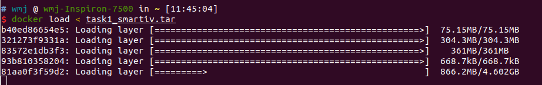
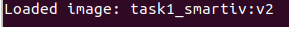
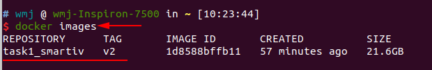
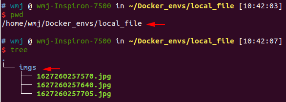
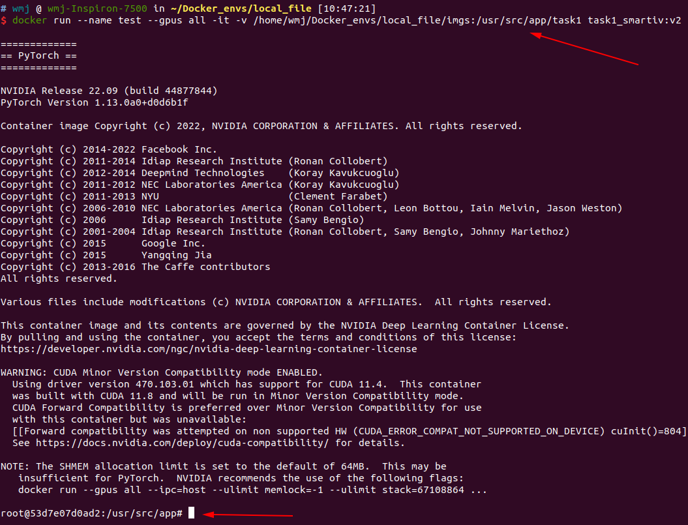
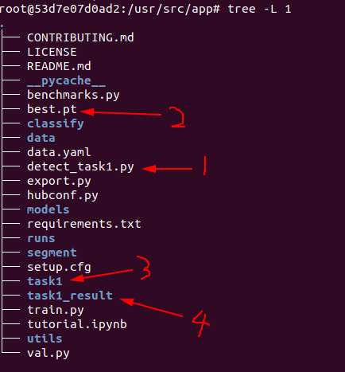
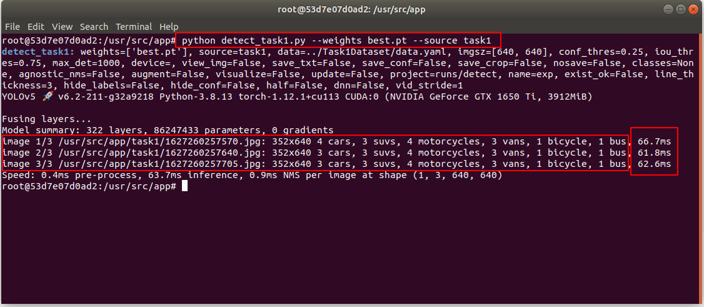
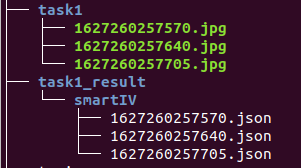

# SmartIV-yolov5（参考链接：[YOLOV5](https://github.com/ultralytics/yolov5))

0.[数据集下载](https://pan.baidu.com/s/1CI66KM_741wxmW2qS7DVwQ?pwd=zmeh)

```
├── smartIV_yolov5
└── Task1Dataset
    ├── data.yaml  # 数据集配置文件
    ├── images  # 原始图片（8008）
    ├── labels  # txt_处理标签
    └── labels_json  # json_原始标签
```

1.权重下载：[runs/best.pth](https://pan.baidu.com/s/17lj4jlNjDn0IQDbWKWJTfg?pwd=j15h)

```
└── smartIV_yolov5
	......
    ├── models
    ├── README.md
    ├── requirements.txt
    ├── Tools  -->可视化工具文件
    ├── runs
        ├── train
            ├── exp
                └── weights
                    ├── best.pt
                    └── last.pt
	......

```

2.Tools工具使用：

```
├── Tools
    ├── single_json_to_txt.ipynb  # json转txt
    ├── statistic.ipynb  # 数据集标签统计
    ├── split_file.py  # 数据集划分
    ├── vis_dataset.py  # 数据集标签可视化
    ├── vis_result.py  # 测试结果可视化
    ├── compare_img.py  # 前二者可视化结果比较
    └──img2vid.py  # 多帧图片合成视频
```

3.运行：`python detect_task1.py  --weights best.pt -- source task1`

4.保存json结果：`task_result/smartIV/`

5.docker 镜像安装（可选）：

**5.1 镜像下载链接**：[task1_smartiv.tar](https://pan.baidu.com/s/1JhJivCzbmod1IY6yaoVisg?pwd=p9o1)
​    

**5.1 加载镜像：**(加载需要一会儿时间)

```
docker load < task1_smartiv.tar
```



加载成功如下图所示：



 

**5.2 查看镜像：**

```
docker images
```



 

**5.3 容器创建**：将本地测试图片链接到docker环境的`/root/app/task1`路径下（可参考下一条具体示例）

```python
docker run --name <容器名称> --gpus all -it -v <本地存放测试图片文件位置>:/root/app/task1  task1_smartiv:v2
```

**示例**：假设容器名为test，本地测试图片存放路径为`/home/wmj/Docker_envs/local_file/imgs`



将其链接到docker环境下的`task1`文件夹,docker内路径为`/usr/src/app/task1`，具体命令如下：

```
docker run --name test --gpus all -it -v /home/wmj/Docker_envs/local_file/imgs:/usr/src/app/task1  task1_smartiv:v2
```



**5.4 文件说明**：容器创建后默认进入`/usr/src/app/`文件夹下，只需要关注4个文件:

| 1    | detect_task1.py | 主要运行文件                                   |
| ---- | --------------- | ---------------------------------------------- |
| 2    | best.pt         | 训练好的模型权重                               |
| 3    | task1           | 存放测试图片，与之前的本地路径的imgs文件夹链接 |
| 4    | task1_result    | 内有子文件夹smartIV，存放测试结果.json文件     |



​				

**5.5 运行：** `在/usr/src/app/`路径下，运行如下命令:

```
python detect_task1.py --weights best.pt --source task1
```



**5.6 结果查看：** 将生成的`.json`文件自动创建并放置于`/usr/src/app/task1_result/smartIV`下



**5.7 文件转移**：如果想将结果文件从docker镜像迁移出来保存至本地，可以将docker镜像内的文件或者文件夹放到`task1`文件夹下，然后在本地的`/home/wmj/Docker_envs/local_file/imgs`就可以看到了。
